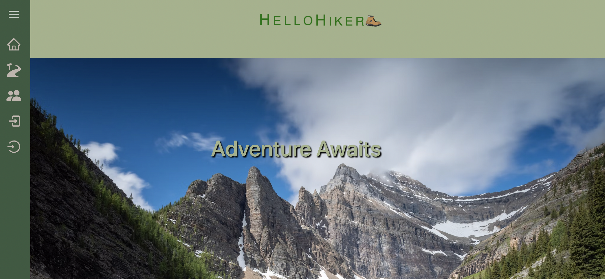

## HelloHiker

run from the deployed app at:  

## Description
A social media application for hikers and trail goers. You can search National Park trails throughout the US.  Allow users to create profiles which will store all trails they have hiked, ones they hope to complete in the future and all them to post, rank, and comment on them. Users can connect with other hikers using the app. 

## Installation
For this project, we created a collaborative MERN-stack single-page application, combining a scalable MongoDB back end, a GraphQL API, and an Express.js and Node.js server with a React front end, implementing user authentication with JWT to build a user-focused platform. We started with the backend, making sure the server was working. We tested each query and mutation in GraphQL, and then implemented it into the front-end components. Using a National Park API, we were able to search trails on our Trail page. We used .jsx, which was a new type of file. We styled the front-end using React and Bootstrap. 

## Usage
HelloHiker is a useful application for people who are looking for a community of hikers. In this one app, you can search for trails to hike, and connect with fellow hikers. The site also has valuable information about National Parks and trails.

## Credits  

<a href="https://github.com/skidmoreco">Corey Skidmore</a>

<a href="https://github.com/dimitra-anasta">Dimitra Anastasopulos</a>

<a href="https://github.com/Nickmason01">Nick Mason</a>

<a href="https://github.com/ShahidHashmi1">Shahid Hashmi</a>

## License

MIT License

Copyright (c) 2022

Permission is hereby granted, free of charge, to any person obtaining a copy of this software and associated documentation files (the "Software"), to deal in the Software without restriction, including without limitation the rights to use, copy, modify, merge, publish, distribute, sublicense, and/or sell copies of the Software, and to permit persons to whom the Software is furnished to do so, subject to the following conditions:

The above copyright notice and this permission notice shall be included in all copies or substantial portions of the Software.

THE SOFTWARE IS PROVIDED "AS IS", WITHOUT WARRANTY OF ANY KIND, EXPRESS OR IMPLIED, INCLUDING BUT NOT LIMITED TO THE WARRANTIES OF MERCHANTABILITY, FITNESS FOR A PARTICULAR PURPOSE AND NONINFRINGEMENT. IN NO EVENT SHALL THE AUTHORS OR COPYRIGHT HOLDERS BE LIABLE FOR ANY CLAIM, DAMAGES OR OTHER LIABILITY, WHETHER IN AN ACTION OF CONTRACT, TORT OR OTHERWISE, ARISING FROM, OUT OF OR IN CONNECTION WITH THE SOFTWARE OR THE USE OR OTHER DEALINGS IN THE SOFTWARE.

https://opensource.org/licenses/MIT
